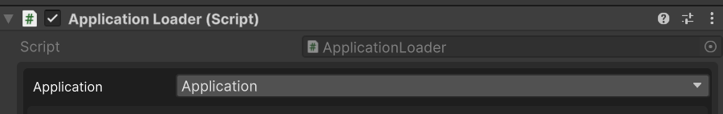

# Unity Interface Serialization Package

## Overview
This Unity package allows for the serialization of interfaces of non-Unity Object types.

## Functionality
When you attempt to serialize an interface, this package resolves its concrete types and provides a serialized dropdown to select the desired concrete type in the Unity Editor.

## Installation
1. In Unity, navigate to `Window > Package Manager`.
2. Click the `+` button in the top-left corner, select `Add package from git URL...`, and enter `git@github.com:mage666/unity-serialize-interface-package.git`.

## Usage

### Example Usage

1. Define the interface you wish to serialize:
    ```csharp
    public interface IApplication
    {
        // Interface members
    }
    ```

2. Create a MonoBehaviour class where you want the interface to be serialized:
    ```csharp
    public class ApplicationLoader : MonoBehaviour
    {
        // MonoBehaviour logic
    }
    ```

3. Use the `[SerializeReference]` and `[SerializeInterface]` attributes to handle serialization:
    ```csharp
    public class ApplicationLoader : MonoBehaviour
    {
        [SerializeReference, SerializeInterface] 
        private IApplication _application;
    }
    ```

4. Create concrete types of `IApplication`, which will be available in the Inspector dropdown:
    ```csharp
    public class Application : IApplication
    {
        // Implementation of the interface
    }
    ```

## Demo


## Version History
See [CHANGELOG.md](CHANGELOG.md) for details.

## Dependencies
- Unity (tested on Unity 6)

## Contributing
Contributions are welcome! Please open an issue or pull request if you have suggestions or bug reports.

## License
This is free and unencumbered software released into the public domain. For more information, please refer to the [LICENSE](LICENSE) file or visit [unlicense.org](http://unlicense.org).